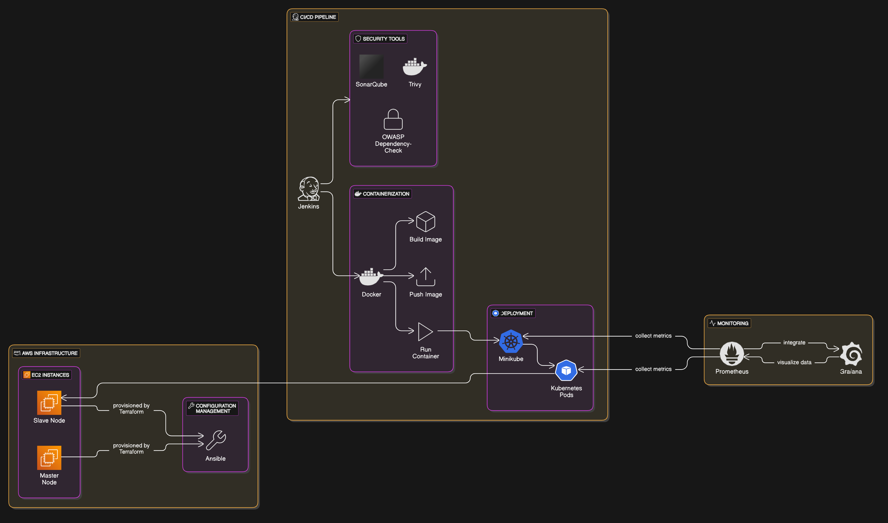
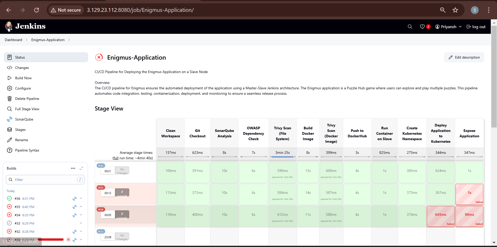
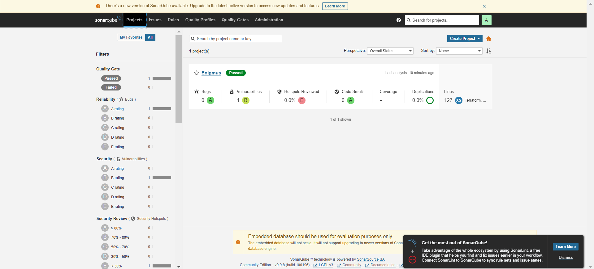
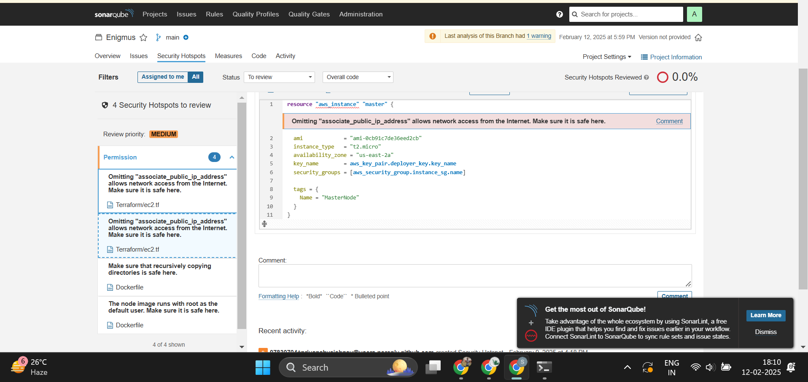
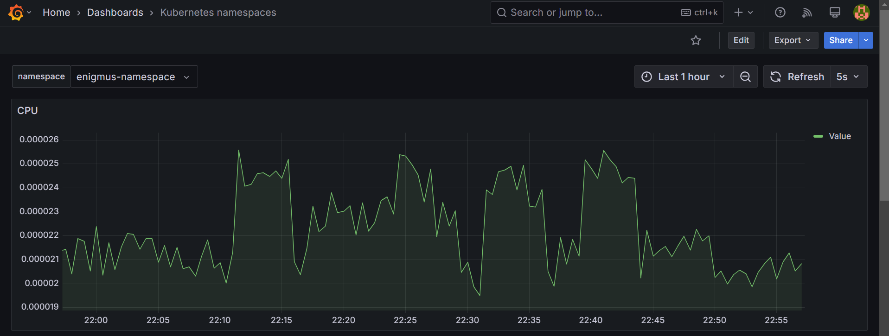

# **Enigmus Project - CI/CD Pipeline with Jenkins, Kubernetes, and Security Scanning**  

## **Overview**
This project automates the deployment of a web application using **Terraform, Ansible, Jenkins, Docker, and Kubernetes (Minikube)**. The CI/CD pipeline integrates **SonarQube, Trivy, and OWASP Dependency-Check** to ensure security and code quality. Additionally, Prometheus and Grafana have been integrated for real-time monitoring of the Kubernetes cluster and application performance.

---

## ** Project Workflow**  

### **1️⃣ Provisioning EC2 Instances** 🖥️  
- Used **Terraform** to create **two EC2 instances**:  
  - **Master Node**: Hosts **Jenkins, SonarQube, and Ansible**.  
  - **Slave Node**: Runs the **application and Minikube (Kubernetes cluster)**.  
- Terraform scripts are available in the **`Terraform/`** folder.  

### **2️⃣ Configuring Master & Slave Nodes** 🔗  
- Installed **Ansible** on the **Master Node** for automated setup.  
- Configured **SSH key-based authentication** to enable secure communication between Master and Slave.  
- Installed essential tools (**Docker, Java, Minikube**) on the **Slave Node** using an **Ansible Playbook** (`install_tool.yaml`).  
- The **inventory file (`hosts`)** is set up on the Master for node management.  

### **3️⃣ Installing Jenkins & CI/CD Setup** ⚙️  
- Installed **Jenkins** on the Master node.  
- Configured required **plugins and tools**:  
  - **Docker**, **SonarQube**, **Trivy**, **OWASP Dependency-Check**  
- Created necessary **credentials** for secure access (GitHub, DockerHub, Kubernetes).  

### **4️⃣ CI/CD Pipeline Workflow** 📜  
1. **Pulls the latest code** from **GitHub**.  
2. **Cleans the workspace** to remove old artifacts.  
3. **Performs Security & Code Quality Analysis**:  
   - **SonarQube** → Code quality analysis  
   - **OWASP Dependency-Check** → Checks for vulnerabilities in dependencies  
   - **Trivy Scans** → Scans the **filesystem & Docker image** for security issues  
4. **Builds the application’s Docker image** and **pushes it to DockerHub**.  
5. **Deploys the application on the Slave Node** using **Kubernetes** (Minikube).  
6. **Creates a Kubernetes namespace** and **exposes the service** to make the application accessible.
7. **Sets up Prometheus monitoring to track container performance.
8. **Visualizes the metrics using Grafana dashboards.

---

## **🛠️ Technologies Used**  

| **Tool** | **Purpose** |
|----------|------------|
| **Terraform** | Infrastructure as Code (**EC2 provisioning**) |
| **Ansible** | Configuration Management (**Installing tools on Slave**) |
| **Jenkins** | CI/CD Automation (**Pipeline execution**) |
| **Docker** | Containerization |
| **Kubernetes (Minikube)** | Orchestration (**Deploying & managing containers**) |
| **SonarQube** | **Code Quality & Static Analysis** |
| **Trivy** | **Security Scanning (Filesystem & Docker images)** |
| **OWASP Dependency-Check** | **Dependency Security Analysis** |
| **Prometheus** | **Monitoring Kubernetes Cluster & Application Metrics** |
| **Grafana** | **Visualizing Metrics via Dashboards** |
---

## **🔧 CI/CD Pipeline Stages in Jenkins**  

✅ **Clean Workspace** 🧹  
✅ **Git Checkout** 📥  
✅ **SonarQube Analysis** 🔍  
✅ **OWASP Dependency Check** 🔒  
✅ **Trivy File System Scan** 🛡️  
✅ **Build Docker Image** 🏗️  
✅ **Trivy Docker Image Scan** ⚠️  
✅ **Push to DockerHub** 📦  
✅ **Run Container on Slave** 🖥️  
✅ **Create Kubernetes Namespace** 📂  
✅ **Deploy Application to Kubernetes** ☸️  
✅ **Expose Application** 🌍  
✅ **Setup Prometheus Monitoring** 📡
✅ **Grafana Dashboard Integration** 📊
---

## **📊 Results & Screenshots**  

### ** ARchitecture **
  
### **🔄 Pipeline Flow**  
  

### **🔌 Exported Ports on Slave Node**  
  

### **📂 Project Structure & Info**  
  

### **🌐 Running Application**  
  

### **🛡️ SonarQube Security Analysis (Hotspots)**  
  

### **Grafana**  
  

For more images, check the **Pictures/** directory.  

---

## **📢 Future Improvements**  
🔹 **Monitoring Integration**: Add **Prometheus & Grafana** for real-time monitoring of pods.  
🔹 **Multi-Node Kubernetes Setup**: Deploy on **AWS EKS** instead of Minikube.  
🔹 **Automated Rollback**: Implement rollback mechanisms in case of failed deployments.  

---

## **📜 License**  
This project is **open-source** and available under the **MIT License**.  
